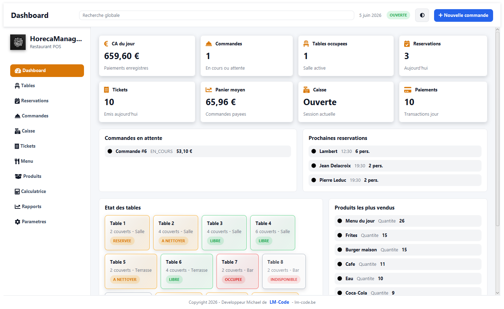
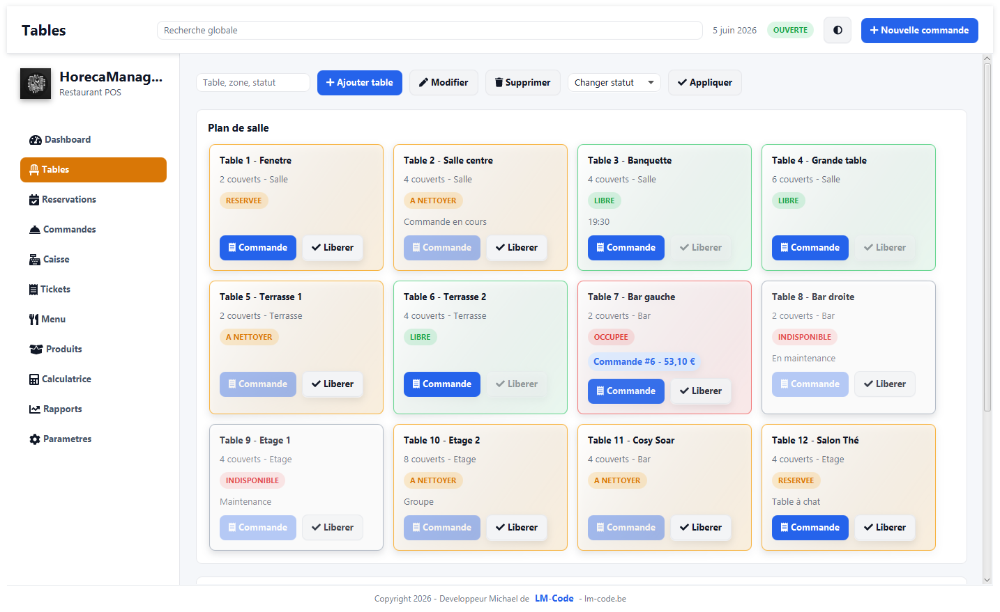
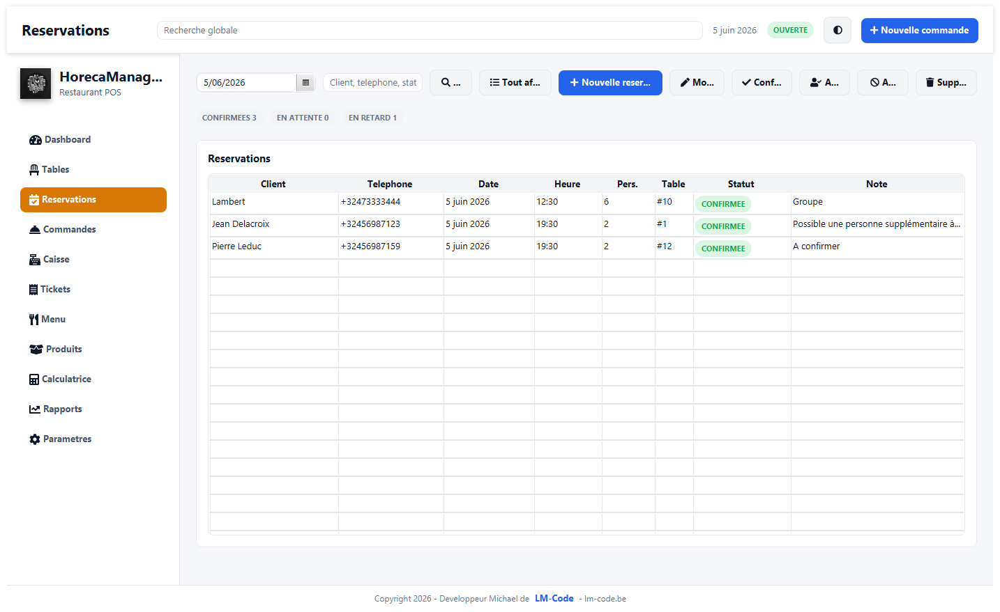
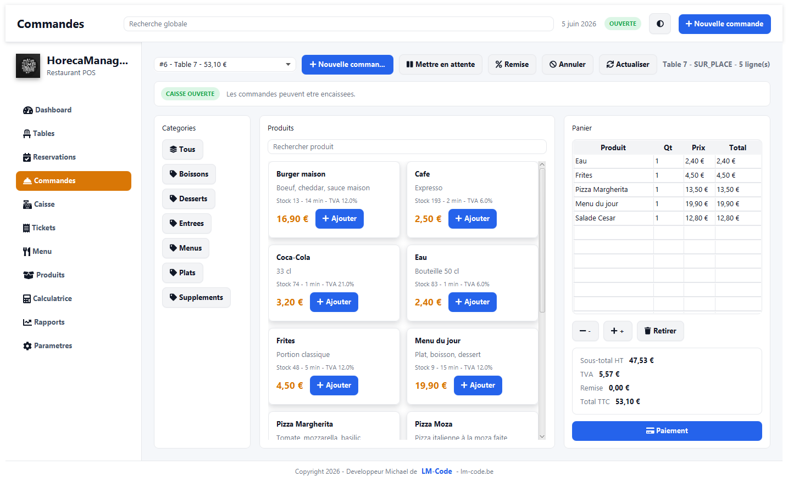
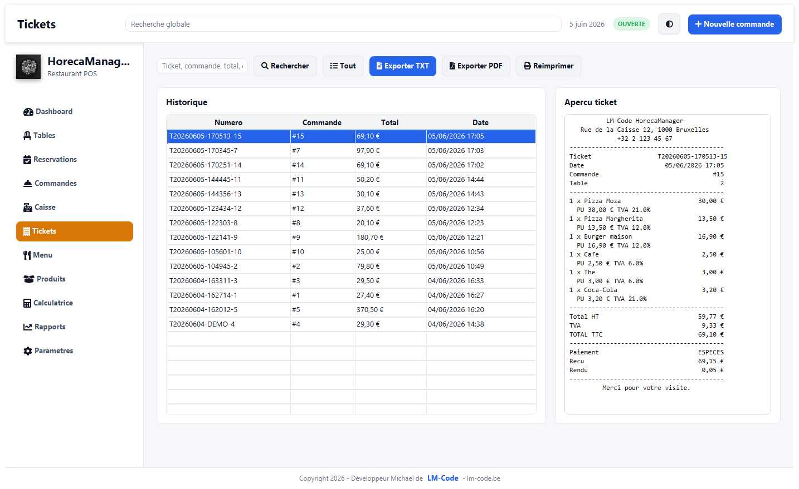
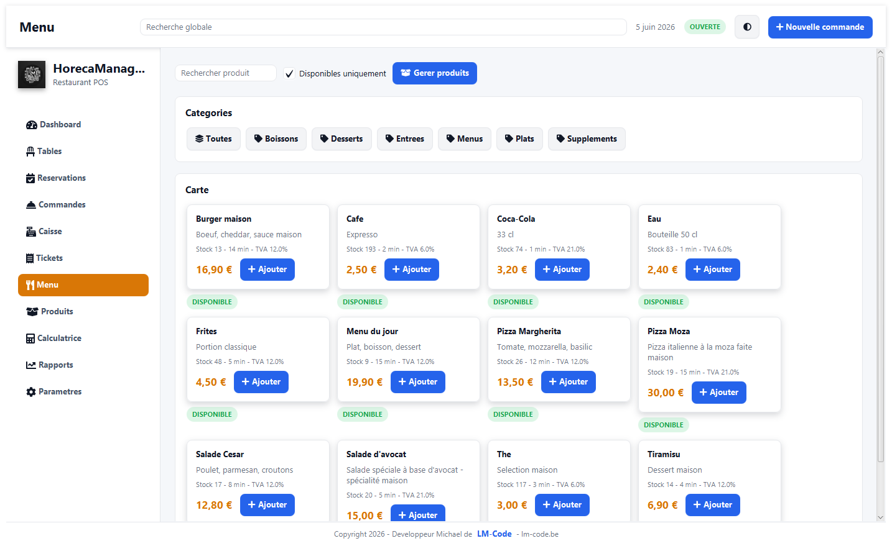
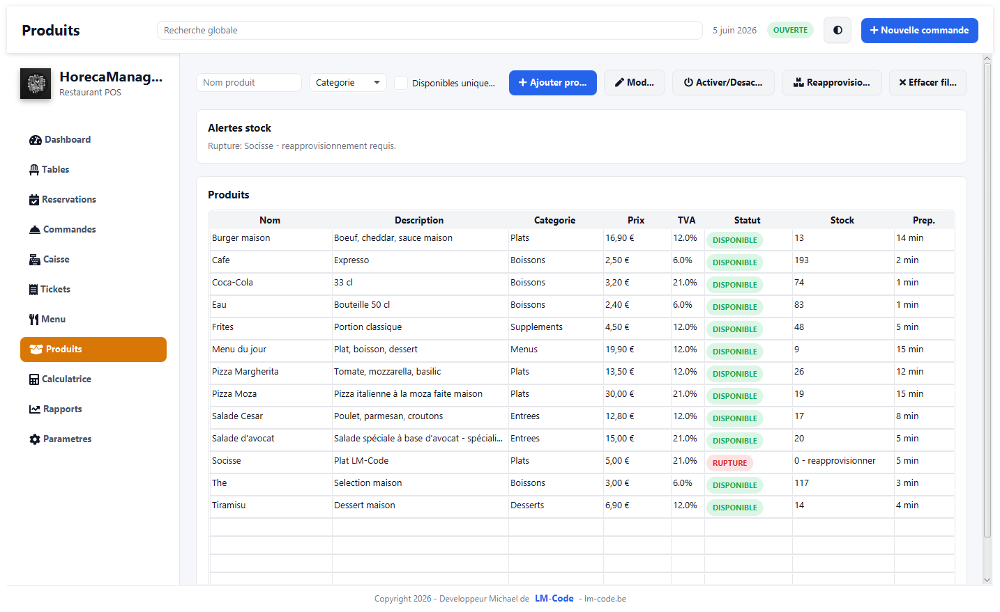
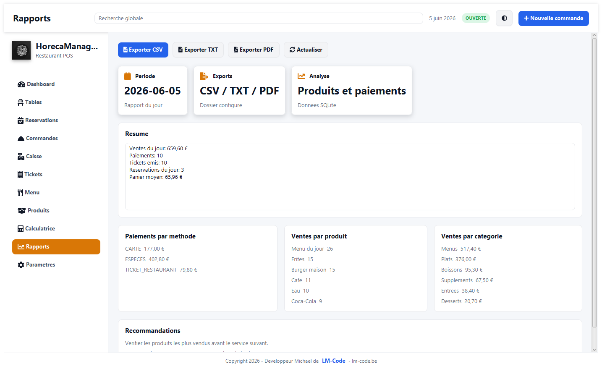
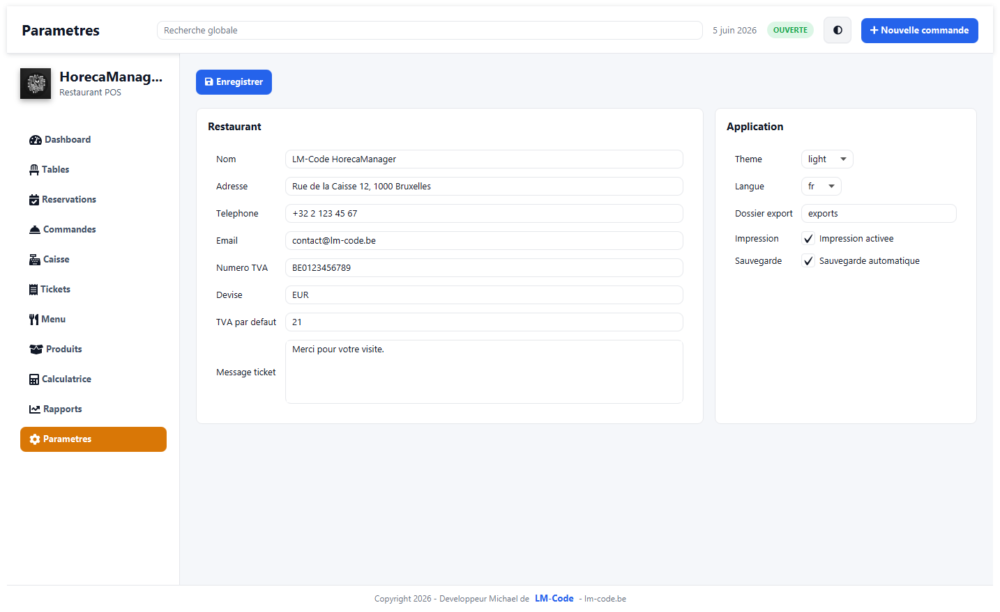

# HorecaManager Pro

HorecaManager Pro est une application desktop de caisse et de gestion pour restaurant, snack, cafe ou bar. Elle permet de gerer les tables, reservations, commandes, paiements, tickets, produits, stocks et rapports depuis une interface JavaFX.

Article associe : [https://lm-code.be/creer-logiciel-gestion-restaurant-javafx-sqlite]

## Technologies utilisees

- Java 21
- JavaFX 21
- Maven
- SQLite
- OpenPDF pour les exports PDF
- Ikonli FontAwesome pour les icones

## Structure du projet

```text
src/main/java/com/lmcode/horecamanager
+-- app              Configuration, session et navigation
+-- controllers      Ecrans JavaFX
+-- database         Initialisation SQLite
+-- models           Modeles metier
+-- repositories     Acces aux donnees SQLite
+-- services         Logique metier
+-- ui               Composants et layout
`-- utils            Formats, validation et exports

src/main/resources
+-- icons            Logo de l'application
`-- styles           Themes et styles JavaFX
```

## Recuperer le projet

### Option 1 : telecharger le ZIP

1. Ouvrir le depot GitHub : https://github.com/LM-Code-Be/horeca-manager.git
2. Cliquer sur `Code`.
3. Cliquer sur `Download ZIP`.
4. Decompresser le fichier ZIP sur le PC.
5. Ouvrir un terminal dans le dossier du projet.

### Option 2 : cloner avec Git

```bash
git clone https://github.com/LM-Code-Be/horeca-manager.git
cd horeca-manager
```

## Installation sur le PC

1. Installer Java JDK 21.
2. Installer Maven 3.9 ou plus recent.
3. Verifier l'installation :

```bash
java -version
mvn -version
```

4. Depuis le dossier du projet, telecharger les dependances :

```bash
mvn clean compile
```

## Lancer l'application

Depuis la racine du projet :

```bash
mvn clean javafx:run
```

Au premier lancement, l'application cree automatiquement le fichier SQLite `horeca_manager.db` a la racine du projet avec des donnees de demonstration.

Pour repartir sur une base neuve, fermer l'application puis supprimer `horeca_manager.db`.

## Exports

Les exports CSV, TXT et PDF sont generes dans le dossier `exports` par defaut. Le dossier d'export peut etre modifie dans l'ecran `Parametres`.

## Captures d'ecran

### Dashboard

Vue d'ensemble du chiffre du jour, des commandes, des reservations, des tickets, des tables et des meilleurs produits.



### Tables

Plan de salle avec les statuts des tables : libre, occupee, reservee, a nettoyer ou indisponible.



### Reservations

Gestion des reservations avec date, client, telephone, nombre de personnes, table et statut.



### Commandes

Interface POS pour ajouter des produits, gerer le panier, appliquer une remise et encaisser.



### Tickets

Historique des tickets avec apercu lisible et exports TXT/PDF.



### Menu

Carte des produits disponibles avec categories, prix, TVA, preparation et stock.



### Produits

Gestion des produits, categories, prix, TVA, disponibilite, stock et reapprovisionnement.



### Rapports

Synthese des ventes, paiements, meilleurs produits, categories et exports.



### Parametres

Configuration du restaurant, du theme, de la langue, des exports et du message ticket.


